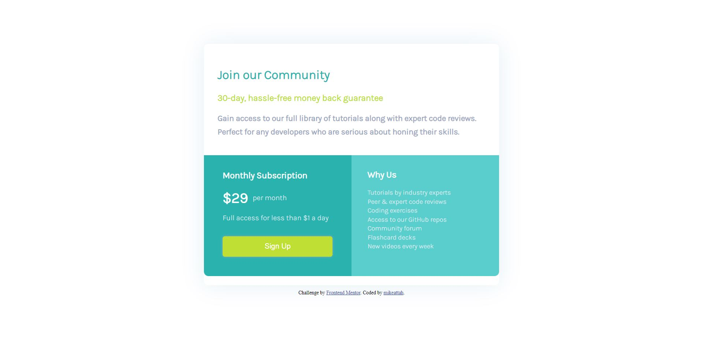

# Frontend Mentor - Single price grid component solution

This is a solution to the [Single price grid component challenge on Frontend Mentor](https://www.frontendmentor.io/challenges/single-price-grid-component-5ce41129d0ff452fec5abbbc). Frontend Mentor challenges help you improve your coding skills by building realistic projects.

## Table of contents

- [Overview](#overview)
  - [The challenge](#the-challenge)
  - [Screenshot](#screenshot)
  - [Links](#links)
- [My process](#my-process)
  - [Built with](#built-with)
  - [Continued development](#continued-development)
- [Author](#author)

**Note: Delete this note and update the table of contents based on what sections you keep.**

## Overview

### The challenge

Users should be able to:

- View the optimal layout for the component depending on their device's screen size
- See a hover state on desktop for the Sign Up call-to-action

### Screenshot

### Links

- View Submission: [Frontend Mentor](https://www.frontendmentor.io/solutions/html-and-css-component-using-flexbox-bKDrw9uoh)
- View Site: [GitHub Pages](https://mikeattah.github.io/frontend-mentor-single-price-grid-component/)

## My process

### Built with

- Semantic HTML5 markup
- CSS custom properties
- Flexbox

### Continued development

I will continue to learn about responsive web design as responsiveness continues to be a challenge for me.

## Author

- Website: [mikeattah.com](https://mikeattah.com)
- Frontend Mentor: [@mikeattah](https://www.frontendmentor.io/profile/mikeattah)
- Twitter: [@mikeattahh](https://www.twitter.com/miikeattah)
